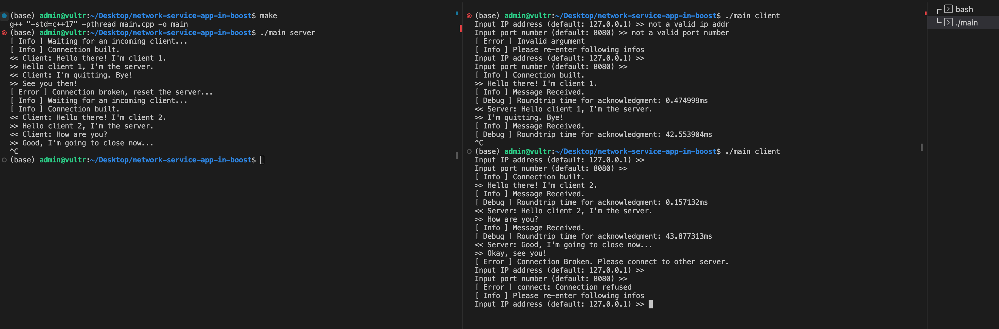

## Simple one on one chat.

### Requirements

> Application should start in two modes:
>
> as a server, waiting for one client to connect or;
>
> as a client, taking an IP address (or hostname) of server to connect to.
After connection is established, user on either side (server and client) can send messages to the other side. After connection is terminated by the client, server continues waiting for another client. The receiving side should acknowledge every incoming message (automatically send back a "message received" indication), sending side should show the roundtrip time for acknowledgment. Wire protocol shouldn't make any assumptions on the message contents (e.g. allowed byte values, character encoding, etc).
> 
>
> UI is your choice - can be just a console.
>
> Requirements:
>
> Application is to be compiled and run on Linux
> Implementation language: C++
> You may use any 3rd-party general-purpose libraries (boost, etc)
> Primary objectives: robustness, code simplicity and maintainability
> Good luck.

## Implementations

### Libs, methods

C++ standard: c++17

Libs: STL, Boost

IO method: Sync (safe, easy)

### Files overview:

```
.
├── client.hpp - client class implementation
├── LICENSE
├── main.cpp - entry codes
├── Makefile - for compiling
├── README.md
├── server.hpp - server class implementation
└── utils.h - some global util functions
```

### How to run this project?

First, build the project

```
make
```

Then, open two terminals, run server and client seperately (the order doesn't matter)

```
./main server
```

```
./main client
```

At server side, it would wait for a client to connect in.
```
(base) admin@vultr:~/Desktop/network-service-app-in-boost$ ./main server
[ Info ] Waiting for an incoming client...
```

At client side, it would ask you to enter the hostname and port. You can leave them blank as default value. There might be connection failure when invalid arguments or connection refuse come; at those moments, it will let you enter over and over again until there's one success.

```
(base) admin@vultr:~/Desktop/network-service-app-in-boost$ ./main client
Input IP address (default: 127.0.0.1) >> 
Input port number (default: 8080) >> 
```

You'll see both parts show **Connection built.** if it succeeds.

Then you can chat on both sides. Starting from the client. 

If the connection is broken on server side, the client won't get any response, it will ask you to connect to another server (if you like you could still use the original one).

Until you really connect another one.

```
[ Error ] Connection Broken. Please connect to another server.
Input IP address (default: 127.0.0.1) >> 
Input port number (default: 8080) >> 
```

If the connection is broken on client side, the server won't get any response, it will wait for the next incoming client.

```
[ Error ] Connection broken, reset the server...
[ Info ] Waiting for an incoming client...
```

## Demo



